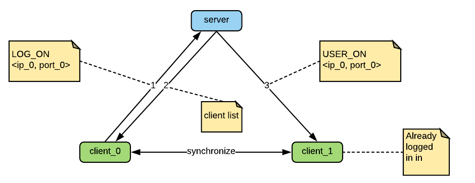
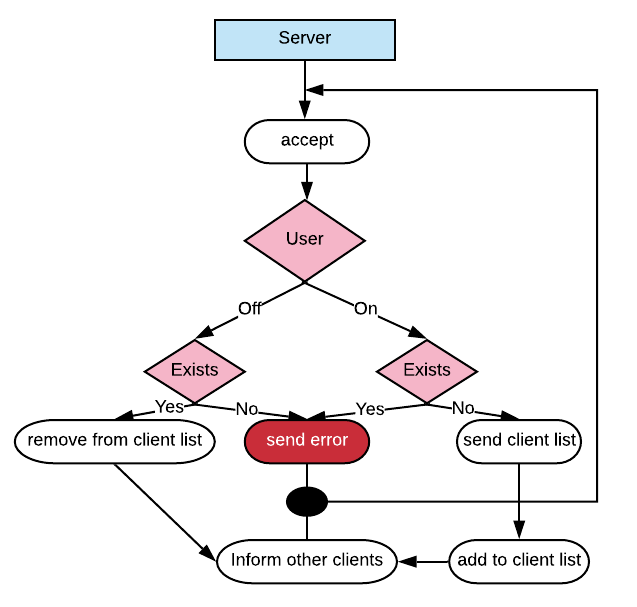
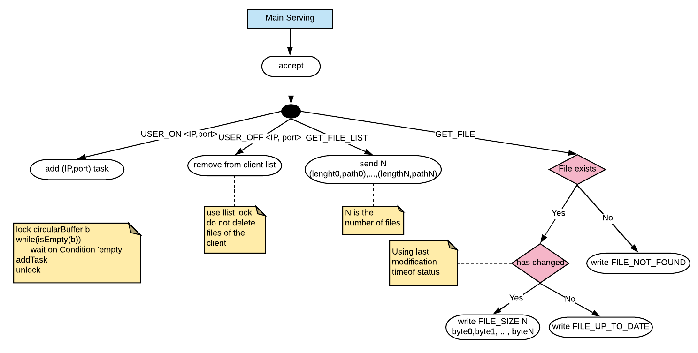
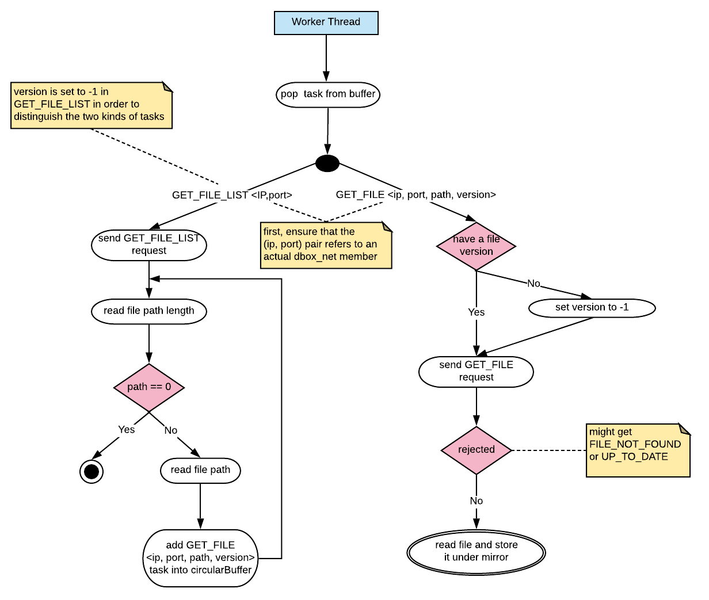

# dbox_net

## Introduction

This **multi-threaded** linux-specific application provides a file-synchronization service to all connected users
using TCP connections over the **network**.
Each client is uniquely identified by a (IP, port) pair
and enters the system with a private **input** folder.
Then, after verification,
a special **mirror** folder is created under the same folder as input.
Finally, the dbox_net **server** sends the client list to the new one, containing (IP, port) pairs
of all clients connected. In addition, the server informs all clients about the new arrival.
After that, it is up to them to get synchronized with the new client
and look out for any inner coming or outgoing clients.  
So this is a **peer-to-peer** application.  

<div style="text-align:center">
    
</div>

## How it works

Here, we will not get in much detail, but rather use a high level representation of dbox_net
functionality, using simple diagrams. Source code is very well commented, so do not hesitate to take
a look at each component of this system.
To better explain how dbox_net works, let us distinguish the server from the client
and analyze each of them.

### dbServer

This process is running at all times and is necessary for dbox_net to work. It requires a
port number given from the command line. For example, use

```bash
~/dbox_net/main/server/dbserver -p 8080
```

to run dbserver on port 8080 under your machine.  
Until an interrupt signal is caught, dbserver is constantly listening to a socket,
accepting TCP client connections. and is responsible of

* accepting or rejecting a request of type USER_ON or USER_OFF
* updating the client list
* inform other clients for an inner coming or outgoing client

Pretty simple and straightforward.
After dealing with a request, connection is closed. Considering how short this connection lasts,
there is no need for threads or other processes here, dbserver handles all requested on his own.
 So, the lifetime of dbserver looks as follows.

<div style="text-align:center">
    
</div>

### The Client

This side is a bit more complicated. Each client uses a **main thread**  in order to

1. Initialize required resources
2. Log-in
3. Add tasks
4. Serve other clients
5. Closure

#### Initialize required resources

This part consists of

* handling command line arguments
* allocating memory and creating all data structures required
* creating all worker threads needed

#### Log-in

To successfully log-in, a connection is established with the dbserver, a LOG_ON (ip, port)
message is sent and a list containing all connected clients is received.

#### Add tasks

For each connected client, a task of the form (IP, port) is added to a circular buffer, for the
**worker threads** to complete later on by getting these files.
The exact role of those is in detail explained later.

#### Serve other clients

Similarly, worker threads of other clients request files of the new one,
so the main thread is responsible of serving those.
Let us take a look on the diagram below, to better understand this.

<div style="text-align:center">
    
</div>

This is continuously happening until closure.
Requests GET_FILE and GET_FILE_LIST require verification of the client.

#### Closure

On an interrupt signal, main thread

* sends a **LOG_OFF** (IP, port) message to the dbserver
* sets power to off, letting all worker threads know about the terminating signal
and waits for them to exit safely
* lets all resources required for this client to operate(e.g list, buffer) go,
de-allocating all memory used.  

### Worker threads

These threads implement the client-side of the peer-to-peer relationship amongst clients, so
they request and receive files of others, until an interrupt signal is caught.
The life of a worker thread looks like this

<div style="text-align:center">
    
</div>
The above is continuously happening until closure.

### Synchronization

For all threads to co-operate and in order to avoid race conditions, all resources are associated
with a lock(pthread_mutex_t).
Notice that the circularBuffer has a fixed capacity given from the command line. That said,
threads might need to wait before adding a task to it. This holds both for the main
thread during initialization and for the worker threads during a GET_FILE_LIST request.
In addition, worker threads might have to wait until a task is added in case of an empty buffer.
Of course, busy waiting is not option,
so the lock of circularBuffer is also associated with two condition variables.

* **fullBuffer**: signaled when a task is removed
* **emptyBuffer**: signaled when a task is added

both of those are broadcasted at closure.

### Run client

After compilation, one can run the client program as follows

```bash
dbox_net/main/client/dbclient -w numberOfWorkerThreads  -d inputDirectoryPath
                              -sip dbserverIpAddress -sp dbserverPortNumber
                              -b circularBufferCapacity -p dbclientPortNumber
  
```

## Epilogue

To bring it all together, this is a simple, easy-to-use, multi-threaded, file-synchronization,
peer-to-peer, network application using linux API for threads and file operations. Hopefully,
that document made things clear. If not, feel free to comment on this project for any
questions or ideas you might have. Last but not least, make sure you take a look at
the source code. Each component is fairly isolated, following the
[single_responsibility_principle](https://en.wikipedia.org/wiki/Single_responsibility_principle)
at all times. As a result, all methods are small in size and easy to understand, hiding all
detail from the user. Of course, this project is accompanied by a makefile.

Thanks for reading.
